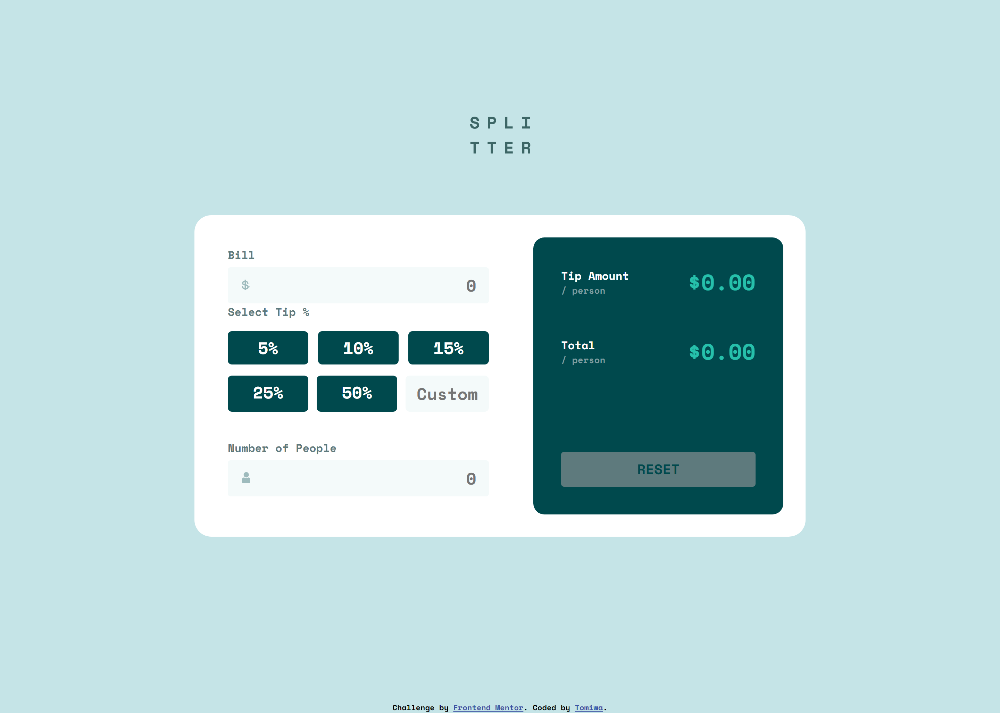

# Frontend Mentor - Tip calculator app solution

This is a solution to the [Tip calculator app challenge on Frontend Mentor](https://www.frontendmentor.io/challenges/tip-calculator-app-ugJNGbJUX). Frontend Mentor challenges help you improve your coding skills by building realistic projects.

## Table of contents

- [Overview](#overview)
  - [The challenge](#the-challenge)
  - [Screenshot](#screenshot)
  - [Links](#links)
- [My process](#my-process)
  - [Built with](#built-with)
  - [What I learned](#what-i-learned)
  - [Useful resources](#useful-resources)
- [Author](#author)


## Overview

### The challenge

Users should be able to:

- View the optimal layout for the app depending on their device's screen size
- See hover states for all interactive elements on the page
- Calculate the correct tip and total cost of the bill per person

### Screenshot




### Links

- Solution URL: [Add solution URL here](https://github.com/jidoggs/Tip-Calculator)
- Live Site URL: [Add live site URL here](https://tip-calculator-puce.vercel.app/)

## My process

### Built with

- Semantic HTML5 markup
- CSS custom properties
- Flexbox
- Mobile-first workflow


### What I learned

I learnt to use as much semantic tags as possible and in situations where i could not i use the arial landmarks. Flex Box was really helpful while working on my layout. Centering elements, I made more use of the width and margin hack as compared to other methods.
i also learnt how to make an element that naturally does not have a foucus ability to be able to focus using the tab index property.

I also learnt how to use JavaScript to manipulate both the CSS and HTML.


To see how you can add code snippets, see below:

```html
<div class="input-bill count-bill" role="group">
  <span class="icon-input icon-dollar" role="img"></span>
x  <input type="number" name="bill" id="bill" placeholder="0" class="input-amount">
</div>

<div id="btn-5" class="btn btn-small" value="5" onclick="calculateTip(5)" tabindex="1" role="button">
```

```js
document.getElementById('people').style.borderColor="transparent"
document.getElementById('per-person-tip').innerHTML = "$0.00";
```

### Useful resources

- [Example resource 1](https://dequeuniversity.com/rules/axe/4.2/region?application=axeAPI) - It help me with use of arieal landmarks
- [Example resource 2](https://developer.mozilla.org) - I cannot state the importance of this


## Author

- Frontend Mentor - [@yourusername](https://www.frontendmentor.io/profile/jidoggs)
- Twitter - [@yourusername](https://www.twitter.com/jidde_)


